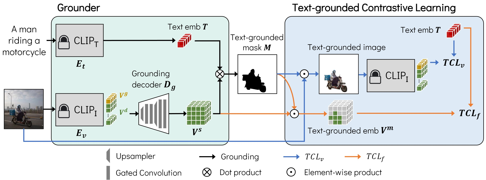
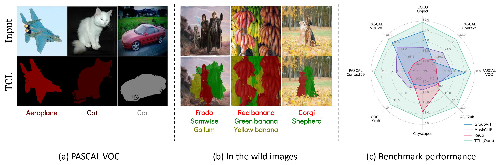
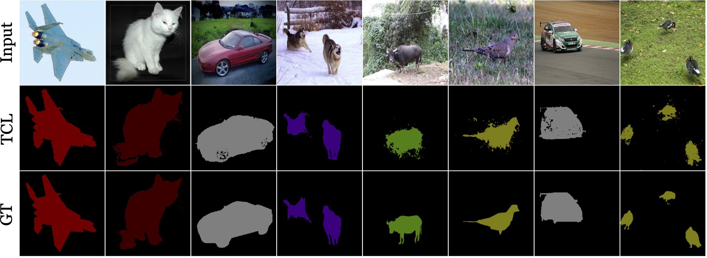
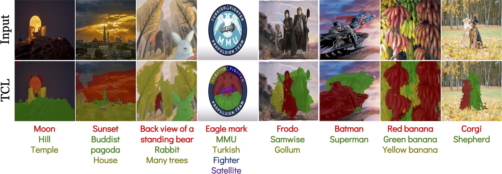

# TCL: Text-grounded Contrastive Learning (CVPR'23)

Official PyTorch implementation of [**Learning to Generate Text-grounded Mask for Open-world Semantic Segmentation from Only Image-Text Pairs**](https://arxiv.org/abs/2212.00785), *Junbum Cha, Jonghwan Mun, Byungseok Roh*, CVPR 2023.

**T**ext-grounded **C**ontrastive **L**earning (TCL) is an open-world semantic segmentation framework using only image-text pairs. TCL enables a model to learn region-text alignment without train-test discrepancy.

[**Demo page**](https://huggingface.co/spaces/khanrc/tcl) is available. Since this demo runs on a free HuggingFace CPU space, inference times may take around 5-10 seconds.

<div align="center">
<figure>
  
</figure>
</div>


## Results

TCL can perform segmentation on both (a, c) existing segmentation benchmarks and (b) arbitrary concepts, such as proper nouns and free-form text, in the wild images.

<div align="center">
<figure>
  
</figure>
</div>

<br/>

<details>
<summary> Additional examples in PASCAL VOC </summary>
<p align="center">
  
</p>
</details>

<details>
<summary> Additional examples in the wild </summary>
<p align="center">
  
</p>
</details>


## Dependencies

We used pytorch 1.12.1 and torchvision 0.13.1.

```bash
pip install -U openmim
mim install mmcv-full==1.6.2 mmsegmentation==0.27.0
pip install -r requirements.txt
```

Note that the order of requirements roughly represents the importance of the version.
We recommend using the same version for at least `webdataset`, `mmsegmentation`, and `timm`.


## Datasets

Note that much of this section is adapted from the [data preparation section of GroupViT README](https://github.com/NVlabs/GroupViT#data-preparation).

We use [webdataset](https://webdataset.github.io/webdataset/) as scalable data format in training and [mmsegmentation](https://github.com/open-mmlab/mmsegmentation) for semantic segmentation evaluation.

The overall file structure is as follows:

```shell
TCL
├── data
│   ├── gcc3m
│   │   ├── gcc-train-000000.tar
│   │   ├── ...
│   ├── gcc12m
│   │   ├── cc-000000.tar
│   │   ├── ...
│   ├── cityscapes
│   │   ├── leftImg8bit
│   │   │   ├── train
│   │   │   ├── val
│   │   ├── gtFine
│   │   │   ├── train
│   │   │   ├── val
│   ├── VOCdevkit
│   │   ├── VOC2012
│   │   │   ├── JPEGImages
│   │   │   ├── SegmentationClass
│   │   │   ├── ImageSets
│   │   │   │   ├── Segmentation
│   │   ├── VOC2010
│   │   │   ├── JPEGImages
│   │   │   ├── SegmentationClassContext
│   │   │   ├── ImageSets
│   │   │   │   ├── SegmentationContext
│   │   │   │   │   ├── train.txt
│   │   │   │   │   ├── val.txt
│   │   │   ├── trainval_merged.json
│   │   ├── VOCaug
│   │   │   ├── dataset
│   │   │   │   ├── cls
│   ├── ade
│   │   ├── ADEChallengeData2016
│   │   │   ├── annotations
│   │   │   │   ├── training
│   │   │   │   ├── validation
│   │   │   ├── images
│   │   │   │   ├── training
│   │   │   │   ├── validation
│   ├── coco_stuff164k
│   │   ├── images
│   │   │   ├── train2017
│   │   │   ├── val2017
│   │   ├── annotations
│   │   │   ├── train2017
│   │   │   ├── val2017
```

The instructions for preparing each dataset are as follows.

### Training datasets

In training, we use Conceptual Caption 3m and 12m. We use [img2dataset](https://github.com/rom1504/img2dataset) tool to download and preprocess the datasets.

#### GCC3M

Please download the training split annotation file from [Conceptual Caption 3M](https://ai.google.com/research/ConceptualCaptions/download) and name it as `gcc3m.tsv`.

Then run `img2dataset` to download the image text pairs and save them in the webdataset format.
```
sed -i '1s/^/caption\turl\n/' gcc3m.tsv
img2dataset --url_list gcc3m.tsv --input_format "tsv" \
            --url_col "url" --caption_col "caption" --output_format webdataset \
            --output_folder data/gcc3m \
            --processes_count 16 --thread_count 64 \
            --image_size 512 --resize_mode keep_ratio --resize_only_if_bigger True \
            --enable_wandb True --save_metadata False --oom_shard_count 6
rename -d 's/^/gcc-train-/' data/gcc3m/*
```
Please refer to [img2dataset CC3M tutorial](https://github.com/rom1504/img2dataset/blob/main/dataset_examples/cc3m.md) for more details.

#### GCC12M

Please download the annotation file from [Conceptual Caption 12M](https://github.com/google-research-datasets/conceptual-12m) and name it as `gcc12m.tsv`.

Then run `img2dataset` to download the image text pairs and save them in the webdataset format.
```
sed -i '1s/^/caption\turl\n/' gcc12m.tsv
img2dataset --url_list gcc12m.tsv --input_format "tsv" \
            --url_col "url" --caption_col "caption" --output_format webdataset \
            --output_folder data/gcc12m \
            --processes_count 16 --thread_count 64 \
            --image_size 512 --resize_mode keep_ratio --resize_only_if_bigger True \
            --enable_wandb True --save_metadata False --oom_shard_count 6
rename -d 's/^/cc-/' data/gcc12m/*
```
Please refer to [img2dataset CC12M tutorial](https://github.com/rom1504/img2dataset/blob/main/dataset_examples/cc12m.md) for more details.


### Evaluation datasets

In the paper, we use 8 benchmarks; (i) w/ background: PASCAL VOC20, PASCAL Context59, and COCO-Object, and (ii) w/o background: PASCAL VOC, PASCAL Context, COCO-Stuff, Cityscapes, and ADE20k.
Since some benchmarks share the data sources (e.g., VOC20 and VOC), we need to prepare 5 datasets: PASCAL VOC, PASCAL Context, COCO-Stuff164k, Cityscapes, and ADE20k.

Please download and setup [PASCAL VOC](https://github.com/open-mmlab/mmsegmentation/blob/master/docs/en/dataset_prepare.md#pascal-voc), [PASCAL Context](https://github.com/open-mmlab/mmsegmentation/blob/master/docs/en/dataset_prepare.md#pascal-context), [COCO-Stuff164k](https://github.com/open-mmlab/mmsegmentation/blob/master/docs/en/dataset_prepare.md#coco-stuff-164k), [Cityscapes](https://github.com/open-mmlab/mmsegmentation/blob/master/docs/en/dataset_prepare.md#cityscapes), and [ADE20k](https://github.com/open-mmlab/mmsegmentation/blob/master/docs/en/dataset_prepare.md#ade20k) datasets following [MMSegmentation data preparation document](https://github.com/open-mmlab/mmsegmentation/blob/master/docs/en/dataset_prepare.md).

#### COCO Object

COCO-Object dataset uses only object classes from COCO-Stuff164k dataset by collecting instance semgentation annotations.
Run the following command to convert instance segmentation annotations to semantic segmentation annotations:

```shell
python convert_dataset/convert_coco.py data/coco_stuff164k/ -o data/coco_stuff164k/
```


## Training

We use 16 and 8 NVIDIA V100 GPUs for the main and ablation experiments, respectively.

### Single node

```
torchrun --rdzv_endpoint=localhost:5 --nproc_per_node=auto main.py --cfg ./configs/tcl.yml
```

### Multi node

```
torchrun --rdzv_endpoint=$HOST:$PORT --nproc_per_node=auto --nnodes=$NNODES --node_rank=$RANK main.py --cfg ./configs/tcl.yml
```

## Evaluation

We provide [an official checkpoint](https://github.com/kakaobrain/tcl/releases/download/v1.0.0/tcl.pth) to reproduce the main results of our paper.

- Zero-shot transfer to semantic segmentation (Table 2):

```
torchrun --rdzv_endpoint=localhost:5 --nproc_per_node=auto main.py --resume checkpoints/tcl.pth --eval
```

- Evaluation without PAMR (Table 3 in Appendix):

```
torchrun --rdzv_endpoint=localhost:5 --nproc_per_node=auto main.py --resume checkpoints/tcl.pth --eval \
    --opts evaluate.pamr=false evaluate.bg_thresh=0.5
```

Note that we use `bg_threshold` of 0.4 with PAMR and 0.5 without PAMR, since we observed that PAMR tends to reduce the foreground area.


## Citation

```bibtex
@inproceedings{cha2022tcl,
  title={Learning to Generate Text-grounded Mask for Open-world Semantic Segmentation from Only Image-Text Pairs},
  author={Cha, Junbum and Mun, Jonghwan and Roh, Byungseok},
  booktitle={Proceedings of the IEEE/CVF Conference on Computer Vision and Pattern Recognition (CVPR)},
  year={2023}
}
```


## License

This project is released under [MIT license](./LICENSE).
