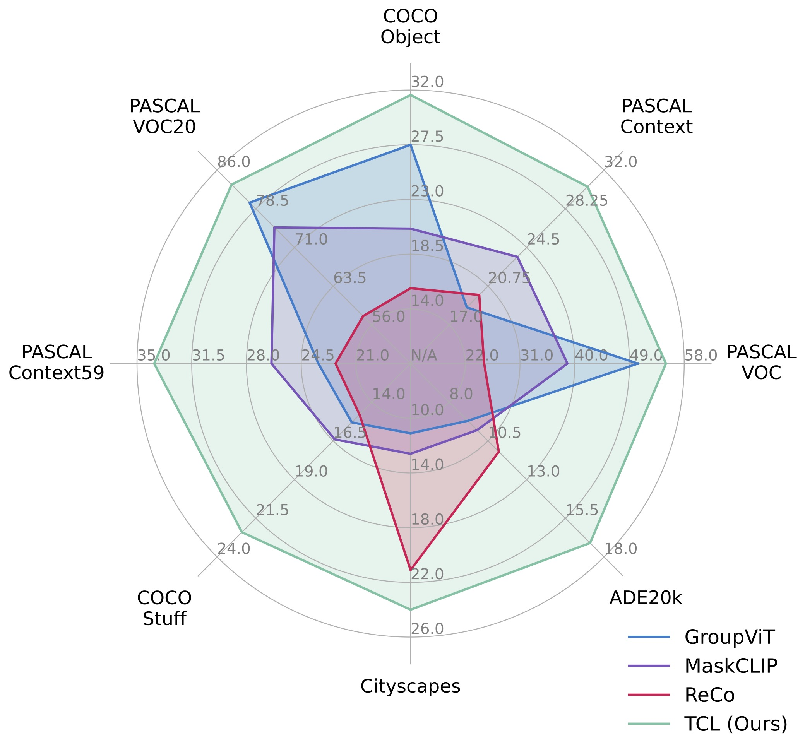

# TCL: Text-grounded Contrastive Learning for Unsupervised Open-world Semantic Segmentation

**Learning to Generate Text-grounded Mask for Open-world Semantic Segmentation from Only Image-Text Pairs**

Junbum Cha, Jonghwan Mun, and Byungseok Roh.

The code will be released soon.

<div align="center">
<figure>
  
</figure>
</div>


## Visual examples

- Qualitative examples in PASCAL VOC

<p align="center">
  
</p>

- Qualitative examples in the wild

<p align="center">
  
</p>


## Citation

```bibtex
@inproceedings{cha2022tcl,
  title={Learning to Generate Text-grounded Mask for Open-world Semantic Segmentation from Only Image-Text Pairs},
  author={Junbum Cha and Jonghwan Mun and Byungseok Roh},
  booktitle={arxiv},
  year={2022}
}
```
